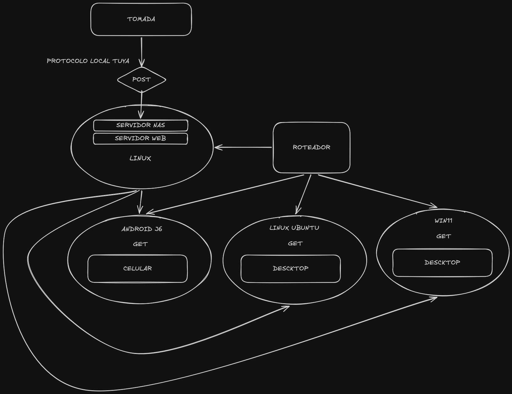

# Medidor de Energia Coworking

O Smart Coworking é uma solução completa de IoT que transforma o modelo de negócios tradicional. Em vez de cobrar por tempo de uso, o sistema monitora o consumo real de energia (Watts) de cada estação de trabalho em tempo real, permitindo um modelo de tarifação "pague-pelo-que-consome" (Pay-per-Watt).

O sistema integra hardware de medição via **Tuya Smart**, processamento de dados em containers e interfaces multiplataforma para garantir transparência ao cliente e controle total ao proprietário.

## Overview



## Authors

- [@Joao](https://www.github.com/JoaoBringmann)
- [@Gabriel](https://github.com/dogo-o)
- [@Eduardo](https://github.com/EduardoMonteiroHinz)
- [@Leonardo](https://github.com/leograttao)
- [@Mauricio](https://github.com/maugazda)

## Funcionalidades

- **Monitoramento em Tempo Real**: Coleta de dados de consumo de energia via MQTT de dispositivos IoT (tomadas inteligentes Tuya).
- **Cadastro de Tomadas Inteligentes**: Página de configurações para registrar tomadas Tuya com credenciais API (Device ID, API Key, API Secret, Token).
- **Armazenamento de Dados**:
  - Séries temporais em **InfluxDB** para métricas de energia
  - Dados relacionais em **PostgreSQL** para usuários, sessões, créditos e configuração de tomadas
- **Dashboard Interativo**: Interface web para o gerente com login seguro, exibindo:
  - Tempo total de uso (horas)
  - Energia total gasta (kWh)
  - Total pago (R$)
  - Gráfico de barras com consumo por tomada
  - Gráfico de distribuição de energia (Doughnut)
  - Tabela detalhada de tomadas e consumo
- **Gerador de Relatórios em PDF**: Sistema de exportação de relatórios personalizados em PDF com:
  - Tempo total de uso
  - Energia total gasta
  - Total pago
  - Consumo detalhado por tomada
- **Autenticação**: Sistema de login para administradores com JWT e hash de senha.
- **Integração com Grafana** (Opcional): Dashboard adicional para visualização avançada e análises customizadas.
- **Servidor Web**: Apache como proxy reverso para a API FastAPI.
- **NAS Simulado**: Compartilhamento de arquivos via Samba.

## Tecnologias Utilizadas

- **Backend**: Python 3.11, FastAPI, SQLAlchemy, Pydantic
- **Banco de Dados**: PostgreSQL 15 (dados relacionais), InfluxDB 1.8 (séries temporais)
- **Mensageria**: Mosquitto (MQTT)
- **Frontend**: HTML5, CSS3, JavaScript (Chart.js para gráficos), Jinja2 templates
- **Integração IoT**: Tuya Smart API para controle e monitoramento de tomadas inteligentes
- **Exportação**: FPDF para geração de relatórios em PDF
- **Containerização**: Docker, Docker Compose
- **Autenticação**: JWT (PyJWT), PassLib (hash de senha)
- **Proxy Reverso**: Apache HTTP Server 2.4
- **Compartilhamento de Arquivos**: Samba (NAS)
- **Cache**: Redis

## Pré-requisitos

- Docker e Docker Compose instalados
- Portas disponíveis: 80 (Apache), 3000 (Grafana), 5432 (PostgreSQL), 6379 (Redis), 8086 (InfluxDB), 1883 (MQTT), 1139/1445 (Samba), 8000 (API)
- Conta Tuya IoT (para credenciais da API)

## Instalação e Execução

### 1. Clonar o repositório
```bash
git clone <url-do-repo>
cd Medidor_Energia_Coworking
```

### 2. Configurar variáveis de ambiente (opcional)

Crie um arquivo `.env` na pasta `src/`:

```env
DB_USER=admin
DB_PASSWORD=password123
DB_NAME=smart_lan
GRAFANA_USER=admin
GRAFANA_PASSWORD=admin123
```

### 3. Iniciar os serviços
```bash
cd src
docker-compose up --build
```

### 4. Executar testes e popular dados
```bash
docker-compose run --rm api python setup_teste.py
```

### 5. Acessar a aplicação
- **Dashboard do Gerente**: http://localhost (login: admin, senha: admin123)
- **Página de Configurações**: http://localhost/settings
- **Gerador de Relatórios**: http://localhost/reports
- **Grafana** (opcional): http://localhost:3000 (admin/admin123)
- **API FastAPI** (interna): http://localhost:8000
- **MQTT Broker**: localhost:1883
- **InfluxDB**: http://localhost:8086

## Estrutura do Projeto

```
Medidor_Energia_Coworking/
├── src/
│   ├── apache/
│   │   └── httpd.conf              # Configuração do Apache (proxy reverso)
│   ├── grafana/
│   │   └── datasources.yml         # Configuração de datasources do Grafana
│   ├── routers/
│   │   ├── auth.py                 # Rotas de autenticação (login/logout)
│   │   ├── dashboard.py            # Rotas do dashboard (métricas e gráficos)
│   │   └── settings.py             # Rotas de configurações (tomadas Tuya)
│   ├── static/
│   │   └── style.css               # Estilos CSS (design responsivo)
│   ├── templates/
│   │   ├── login.html              # Página de login
│   │   ├── dashboard.html          # Dashboard com métricas e gráficos
│   │   ├── reports.html            # Gerador de PDF de relatórios
│   │   └── settings.html           # Página de configuração de tomadas
│   ├── config.py                   # Configuração de caminhos (static, templates)
│   ├── database.py                 # Configuração de conexão SQLAlchemy + PostgreSQL
│   ├── models.py                   # Modelos SQLAlchemy (User, Session, Outlet, Credit)
│   ├── main.py                     # Aplicação FastAPI principal
│   ├── requirements.txt            # Dependências Python
│   ├── Dockerfile                  # Container da API
│   ├── docker-compose.yml          # Orquestração de 8 serviços
│   ├── setup_teste.py              # Script para popular dados de teste
│   └── teste_influxdb.py           # Script para testar envio de dados ao InfluxDB
└── README.md                       # Este arquivo
```

## API Endpoints

### Autenticação
- `GET /login` - Página de login
- `POST /login` - Autenticar usuário e gerar JWT
- `GET /logout` - Fazer logout e limpar sessão

### Dashboard

- `GET /dashboard` - Dashboard com métricas e gráficos (requer login)

### Relatórios

- `GET /reports` - Página do gerador de PDF de relatórios (requer login)
- `POST /reports/pdf` - Gerar e baixar PDF com dados selecionados

### Configurações
- `GET /settings` - Página de configuração de tomadas inteligentes (requer login)
- `POST /settings/outlet/add` - Adicionar nova tomada Tuya
- `POST /settings/outlet/delete/{outlet_id}` - Remover tomada
- `POST /settings/outlet/update/{outlet_id}` - Atualizar dados da tomada

## Como Configurar Tomadas Tuya

### 1. Preparar o Dispositivo
- Plugue a tomada inteligente Tuya em uma tomada de parede
- Baixe o app Tuya no seu celular e faça login/registre uma conta
- Conecte a tomada ao app Tuya seguindo o tutorial

### 2. Obter Credenciais Tuya
1. Acesse https://iot.tuya.com e faça login
2. Vá para **Cloud Development** → **API**
3. Copie sua **API Key** e **API Secret**
4. Gere um **Token de Acesso** usando a API GetToken
5. No app Tuya, encontre o **Device ID** da sua tomada

### 3. Registrar no Dashboard
1. Acesse http://localhost/settings
2. Preencha o formulário com:
   - Nome da Tomada (ex: Tomada Sala 1)
   - Localização (ex: Sala Principal)
   - Device ID (obtido no app Tuya)
   - API Key e API Secret (do console Tuya)
   - Token de Acesso (gerado na API Tuya)
   - Região (us, eu, cn, in)
3. Clique em "Adicionar Tomada"

## Modelos de Dados

### User
- id (PK)
- username (unique)
- hashed_password
- role (admin, user)

### Outlet (Tomada Inteligente)
- id (PK)
- name (unique) - Nome da tomada
- location - Localização física
- tuya_device_id (unique) - ID do dispositivo Tuya
- tuya_api_key - Chave API Tuya
- tuya_api_secret - Secret da API Tuya
- tuya_token - Token de acesso Tuya
- tuya_region - Região da API (us, eu, cn, in)
- is_connected - Status de conexão (0/1)
- created_at - Data de criação

### Session
- id (PK)
- user_id (FK)
- start_time
- end_time
- outlet_id (FK)

### Credit
- id (PK)
- user_id (FK)
- amount
- timestamp

## Contribuição

1. Fork o projeto
2. Crie uma branch para sua feature (`git checkout -b feature/nova-feature`)
3. Commit suas mudanças (`git commit -am 'Adiciona nova feature'`)
4. Push para a branch (`git push origin feature/nova-feature`)
5. Abra um Pull Request

## Notas de Desenvolvimento

### Grafana

O Grafana é **opcional** e fornecido como ferramenta avançada para análises customizadas. O sistema funciona completamente sem ele através do dashboard nativo e do gerador de PDF. Se você não usar Grafana, pode manter o serviço desligado sem afetar a operação principal.

Para usar o Grafana:

1. Acesse http://localhost:3000
2. Faça login (admin/admin123)
3. Configure datasource para InfluxDB (já pré-configurado)
4. Crie painéis customizados conforme necessário

### InfluxDB

Os dados de consumo são armazenados em InfluxDB com:

- **Measurement**: `consumo`
- **Tags**: `outlet` (ID da tomada)
- **Fields**: `value` (watts consumidos)

### Testes

Para popular dados de teste:

```bash
docker-compose run --rm api python setup_teste.py
```

## Licença

Este projeto é parte de uma entrega acadêmica da CTIC 5P - 2026/S1.
