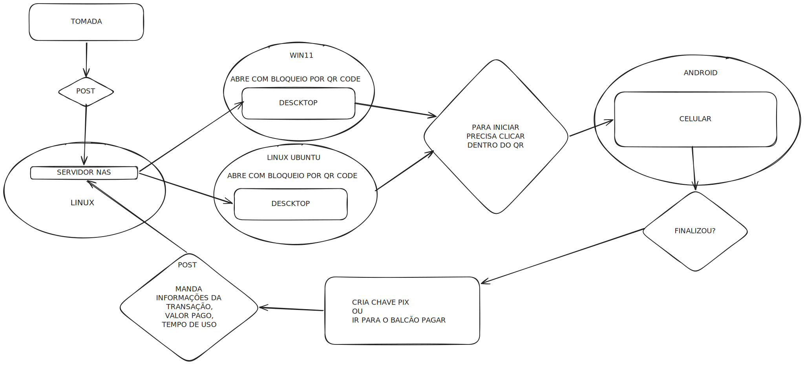

# Medidor de Energia Coworking

O Smart Coworking é uma solução completa de IoT que transforma o modelo de negócios tradicional de LAN Houses. Em vez de cobrar por tempo de uso, o sistema monitora o consumo real de energia (Watts) de cada estação de trabalho em tempo real, permitindo um modelo de tarifação "pague-pelo-que-consome" (Pay-per-Watt).

O sistema integra hardware de medição, processamento de dados em containers e interfaces multiplataforma para garantir transparência ao cliente e controle total ao proprietário.

#Overview


## Authors

- [@Joao](https://www.github.com/JoaoBringmann)
- [@Gabriel](https://github.com/dogo-o)
- [@Eduardo](https://github.com/EduardoMonteiroHinz)
- [@Leonardo](https://github.com/leograttao)
- [@Mauricio](https://github.com/maugazda)

## Funcionalidades

- **Monitoramento em Tempo Real**: Coleta de dados de consumo de energia via MQTT de dispositivos IoT (tomadas inteligentes).
- **Armazenamento de Dados**: Séries temporais em InfluxDB para métricas de energia; dados relacionais em PostgreSQL para usuários, sessões e créditos.
- **Dashboard Interativo**: Interface web para o gerente com login seguro, exibindo:
  - Tempo total de uso (horas).
  - Energia total gasta (kWh).
  - Total pago (R$).
  - Gráfico de barras com consumo por tomada.
- **Autenticação**: Sistema de login para administradores com JWT e hash de senha.
- **Integração com Grafana**: Dashboard adicional para visualização avançada de dados.
- **Servidor Web**: Apache como proxy reverso para a API FastAPI.
- **NAS Simulado**: Compartilhamento de arquivos via Samba.

## Tecnologias Utilizadas

- **Backend**: Python 3.11, FastAPI, SQLAlchemy, Pydantic.
- **Banco de Dados**: PostgreSQL (dados relacionais), InfluxDB 1.8 (séries temporais).
- **Mensageria**: Mosquitto (MQTT).
- **Frontend**: HTML, CSS, JavaScript (Chart.js para gráficos), Jinja2 templates.
- **Containerização**: Docker, Docker Compose.
- **Autenticação**: JWT, PassLib.
- **Outros**: Apache HTTP Server, Samba (NAS).

## Pré-requisitos

- Docker e Docker Compose instalados.
- Porta 80, 3000, 5432, 6379, 8086, 1883, 1139, 1445 disponíveis.

## Instalação e Execução

1. Clone o repositório:
   ```bash
   git clone <url-do-repo>
   cd Medidor_Energia_Coworking/src
   ```

2. Execute os serviços:
   ```bash
   docker-compose up --build
   ```
3. Para realização dos testes:
   ```bash
   docker exec -it backend_api python setup_teste.py
   ```

4. Acesse a aplicação:
   - **Site do Gerente**: http://localhost (login: admin, senha: admin123)
   - **Grafana**: http://localhost:3000 (admin/admin123)
   - **API**: http://localhost:8000 (interna, via Apache)

## Estrutura do Projeto

```
src/
├── apache/
│   └── httpd.conf          # Configuração do Apache
├── routers/
│   ├── auth.py             # Rotas de autenticação
│   └── dashboard.py        # Rotas do dashboard
├── static/
│   └── style.css           # Estilos CSS
├── templates/
│   ├── login.html          # Página de login
│   └── dashboard.html      # Página do dashboard
├── database.py             # Configuração do banco SQL
├── Dockerfile              # Container da API
├── main.py                 # Aplicação FastAPI principal
├── models.py               # Modelos SQLAlchemy
├── requirements.txt        # Dependências Python
└── docker-compose.yml      # Orquestração de containers
```

## API Endpoints

- `GET /login`: Página de login.
- `POST /login`: Autenticação.
- `GET /dashboard`: Dashboard (requer login).
- `GET /logout`: Logout.

## Contribuição

1. Fork o projeto.
2. Crie uma branch para sua feature (`git checkout -b feature/nova-feature`).
3. Commit suas mudanças (`git commit -am 'Adiciona nova feature'`).
4. Push para a branch (`git push origin feature/nova-feature`).
5. Abra um Pull Request.

## Licença

Este projeto é parte de uma entrega acadêmica da CTIC 5P - 2026/S1.
